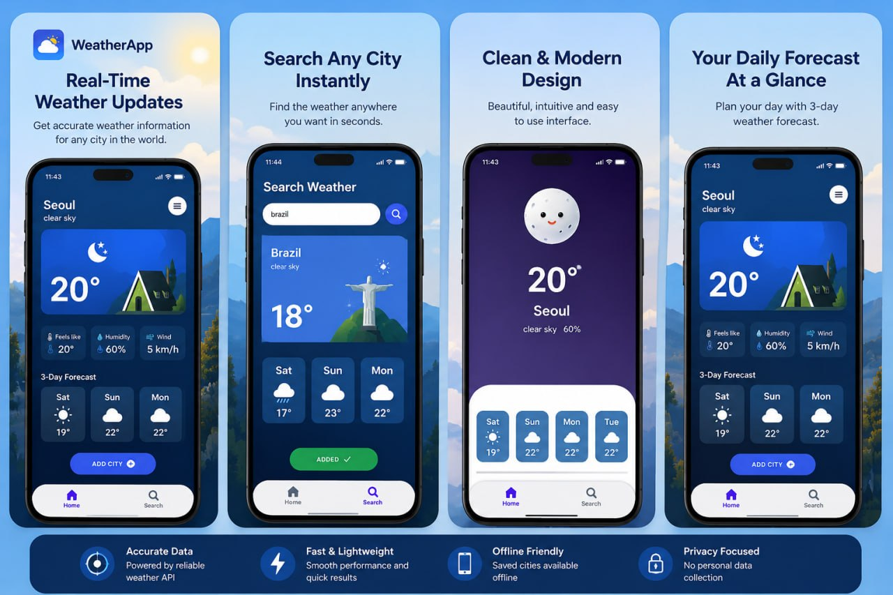

# WeatherAPP ☁️

A simple Android weather application built with Kotlin that provides real-time weather information for any city.

---

## Features

- Search weather by city
- Real-time temperature updates
- Humidity and wind speed
- Weather condition status
- Minimal and clean UI
- Fast API requests

---

## Built With

- Kotlin
- Android Studio
- Retrofit
- Coroutines
- XML
- ViewBinding
- etc

---

##Screenshots


## Preview

You can search any city and instantly get current weather information directly from the API.

---

## Installation

Clone the repository:

```bash
git clone https://github.com/yourusername/weatherAPP.git
```

Open the project in Android Studio.

Add your API key inside the project:


Run the application on emulator or physical device.

---

## API

This project uses the OpenWeather API to fetch weather data.

---

## Project Structure

```text
weatherAPP/
│
├── activities/
├── fragments/
├── network/
├── adapters/
├── retrofit/
└── res/
```

---


## Author

SAM
